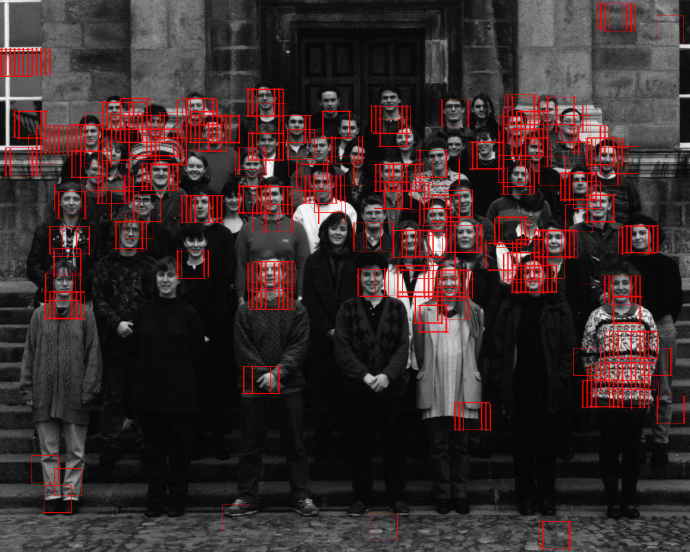

# viola-jones

Rust implementation of the face detection algorithm by Viola and Jones. Because
this was implemented in a class, I used lower-level primitives than what might
otherwise be ideal (eg. PistonDevelopers/image instead of
PistonDevelopers/imageproc, which is included but only used for non-essential
tasks).

There is likely to be a bug somewhere, based on the not-so-great convergence
behavior. The current result looks like this:

